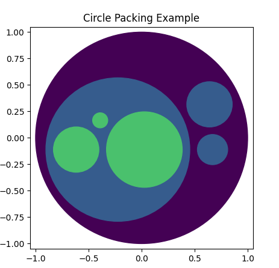

# Circle Packing

*Image generated by `python3 example/small.py`*

This library provides a tool for circle packing in python, using the front-chain packing algorithm by [Wang *et al.*](https://dl.acm.org/doi/10.1145/1124772.1124851) and enclosed by a circle computed using the [Matoušek-Sharir-Welzl algorithm](http://www.inf.ethz.ch/personal/emo/PublFiles/SubexLinProg_ALG16_96.pdf).

# Adapted From D3

The circle pack code is adapted from [d3-hierarchy](https://github.com/d3/d3-hierarchy), which comes with the ISC license found in the LICENSE file.

# Why?

I was doing some circle-packing visualizations with in the order of 1 million total leaf nodes. Performing the layout in the front-end each time was not only wasteful, but taking too long. I didn't find a Python equivalent that met my needs, so I made this. The output of x, y, and r ar ein a numpy array so it's easier to output as a binary dump. This library could be faster, but it is enough for my purposes.

# Installation

Install through `pip`. E.g. `python3 -m pip install npcirclepack`.

Note: if you are getting errors, try installing `numpy` first, then `npcirclepack`.